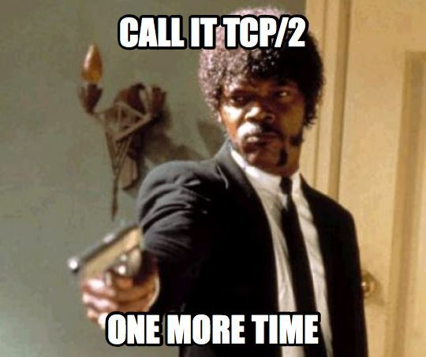

# esp-ngtcp2

  

<h1></h1>

> QUIC protocol stack for ESP-IDF

## Usage

> [!NOTE]  
> `WOLFSSL_USER_SETTINGS` is defined automatically and altough wolfssl recommends that the project defines it as well, it is not needed in this case. If for some reason the settings file is not included, just add something like `idf_build_set_property(COMPILE_OPTIONS "-DWOLFSSL_USER_SETTINGS" APPEND)` after the project declaration of the project's CMake file.

Clone or directly copy the components into the ESP-IDF components directory. Keep in mind that they use git submodules by default, so it is required to initialize the submodules or clone the upstream repos into each component's directory.

With that, everything should work directly with no extra configuration needed, including `WOLFSSL_USER_SETTINGS`. The main component should consequently require only the components that are needed, e. g. don't require nghttp3 if not using HTTP/3.

If any modifications to the components are required, the `port/private_include/config.h` header file should be updated as needed for nghttp3, ngtcp2 and ngtcp2_crypto_wolfssl and `include/user_settings.h` for wolfssl. For example, it may be desirable to enable debugging for nghttp3 by simply `#define DEBUGBUILD 1` inside the configuration file. This way there are no complicated configuration abstractions on top of the header file config on top of CMake of top of KConfig on top of menuconfig interface, which is most convenient because components should be added to version control (even though it may not be benefitial for distributing the components as managed components sice those should not be in version control).

## Sources

* [nghttp3](https://github.com/ngtcp2/nghttp3)
* [ngtcp2](https://github.com/ngtcp2/ngtcp2)
* [wolfssl](https://github.com/wolfSSL/wolfssl)
